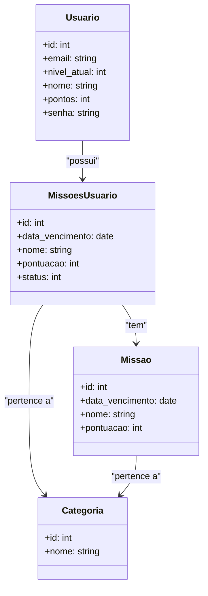

# JoguinhoDaVida
Bem-vindo ao JoguinhoDaVida, a arma contra a procrastinação! Aqui, tarefas diárias se tornam missões empolgantes, gerando pontos e motivação. Enfrente desafios, acumule pontos e conquiste objetivos pessoais e profissionais enquanto chuta a procrastinação para longe. Prepare-se para diversão, motivação e competição saudável. Aventura épica aguarda! 🚀
#

Neste repositório, está guardado o backend do JoguinhoDaVida. Aqui, encontramos uma API REST que gerencia o registro e login de usuários, supervisiona as missões, pontos e níveis individuais de cada usuário através do banco de dados relacional MySQL. A API é fortalecida pela segurança do Spring Security e apoiada por testes unitários utilizando o JUnit.

# Tecnologias Utilizadas

+ Eclipse(IDE)
+ Java 17
+ Apache Maven
+ SpringBoot 3.0.4
+ Spring Security
+ JUnit
+ MySQL
+ H2 Database
+ Swagger

## Documentação

[Documentação](https://github.com/VinnyPC/JoguinhoDaVida/blob/main/docs/Projeto%20Joguinho%20da%20Vida.pdf)

## Banco de dados

+ **tb_usuario:** Contém todos os detalhes do usuário, com o atributo de autenticação sendo o endereço de e-mail.
+ **tb_categoria:** Representa a classificação das missões (por exemplo: profissional, saúde, hobby, etc.).
+ **tb_missoes:** Contém as missões previamente definidas que os usuários podem escolher. Essa abordagem foi escolhida para simplificar o processo, mas há planos de permitir que os usuários criem suas próprias missões no futuro.
+ **tb_missoes_usuario:** Cada usuário tem a liberdade de selecionar várias missões. Quando um usuário ativa uma missão, ela é duplicada da tabela "missoes" para a entidade "missoesUsuario", que, por sua vez, guarda um registro de todas as missões ativas para aquele usuário. Essa foi a abortagem que achei mais simples e confiável.

## Diagrama de Classes

